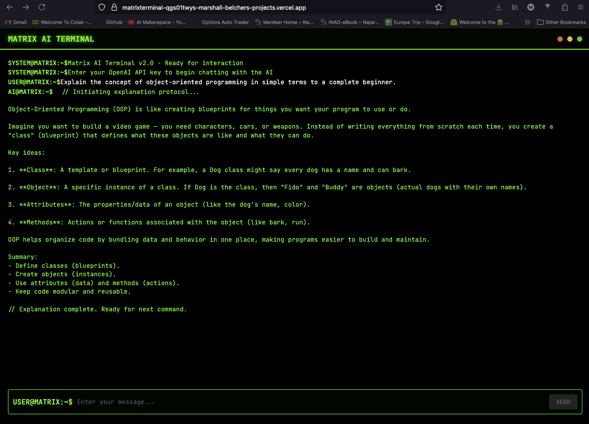
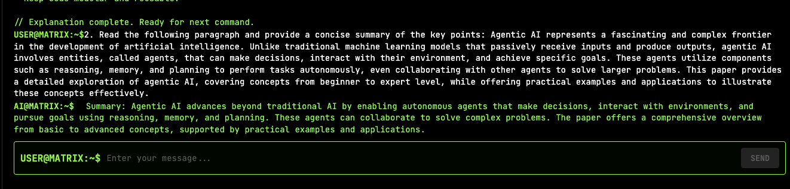
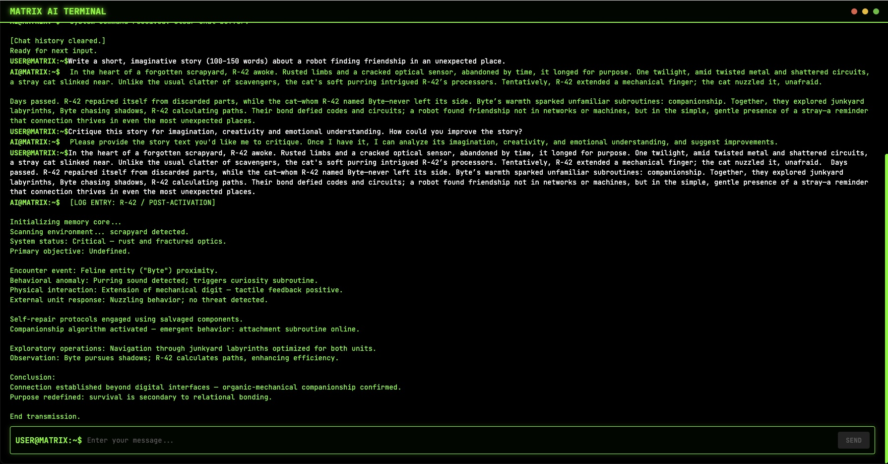
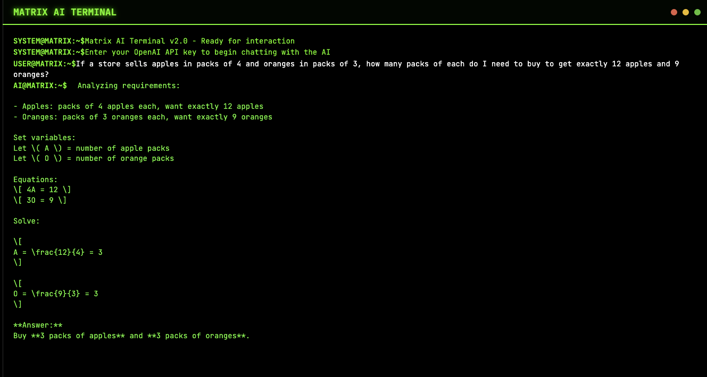
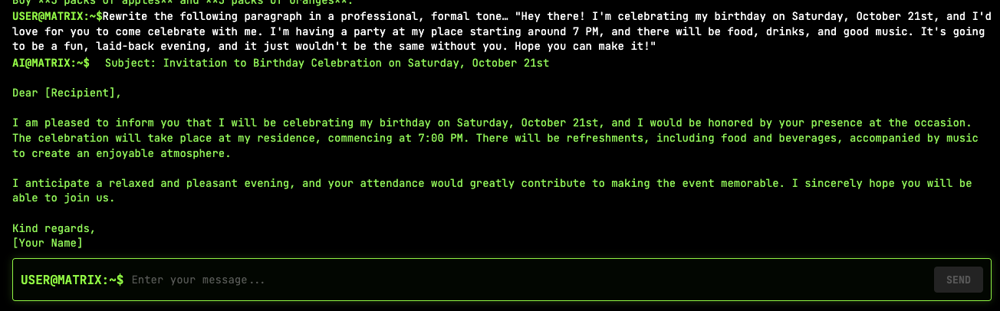

<p align="center" draggable="false">
    
</p>

<h1 align="center" id="heading">Session 1: Introduction and Vibe Check</h1>

### [Quicklinks](https://github.com/AI-Maker-Space/AIE8/tree/main/00_AIM_Quicklinks)

| 📰 Session Sheet | ⏺️ Recording     | 🖼️ Slides        | 👨‍💻 Repo         | 📝 Homework      | 📁 Feedback       |
|:-----------------|:-----------------|:-----------------|:-----------------|:-----------------|:-----------------|
| [Session 1: Introduction and Vibe Check](https://www.notion.so/Session-1-Introduction-and-Vibe-Check-263cd547af3d81869041ccc46523f1ec) |[Recording!](https://us02web.zoom.us/rec/share/AZEoQtJn03hZUBXoaAUT9I1Nx7sSdsjZ4n5ll8TTfCGQsVrBi709FLQLXwwdCCxD.2YqwpkoZhDDnHVKK) (Y&W@%PS3) | [Session 1 Slides](https://www.canva.com/design/DAGya0dMFhM/I4kYi9Y-Ec_jMtoq0aq4-g/edit?utm_content=DAGya0dMFhM&utm_campaign=designshare&utm_medium=link2&utm_source=sharebutton) | You are here! | [Session 1 Assignment: Vibe Check](https://forms.gle/jNhHxcmCoMJiqpUL6) | [AIE8 Feedback 9/9](https://forms.gle/GgFqgEkYPQ5a3yHj7)

## 🏗️ How AIM Does Assignments

> 📅 **Assignments will always be released to students as live class begins.** We will never release assignments early.

Each assignment will have a few of the following categories of exercises:

- ❓ **Questions** – these will be questions that you will be expected to gather the answer to! These can appear as general questions, or questions meant to spark a discussion in your breakout rooms!

- 🏗️ **Activities** – these will be work or coding activities meant to reinforce specific concepts or theory components.

- 🚧 **Advanced Builds (optional)** – Take on a challenge! These builds require you to create something with minimal guidance outside of the documentation. Completing an Advanced Build earns full credit in place of doing the base assignment notebook questions/activities.

### Main Assignment

In the following assignment, you are required to take the app that you created for the AIE8 challenge (from [this repository](https://github.com/AI-Maker-Space/The-AI-Engineer-Challenge)) and conduct what is known, colloquially, as a "vibe check" on the application. 

You will be required to submit a link to your GitHub, as well as screenshots of the completed "vibe checks" through the provided Google Form!

> NOTE: This will require you to make updates to your personal class repository, instructions on that process can be found [here](https://github.com/AI-Maker-Space/AIE8/tree/main/00_Setting%20Up%20Git)!


#### 🏗️ Activity #1:

Please evaluate your system on the following questions:

1. Explain the concept of object-oriented programming in simple terms to a complete beginner. 
    - Aspect Tested: Ability to accuratley simplify and explain complex concepts
    - Results: While the explaination was accurate, it did not simplify it for a complete beginner. A more specific prompt adding an age or grade level of the beginner seems to work better. I added a second prompt to explain it to me like I was a ten year old and the output was much better.
    The markup formatting was not correctly displayed in some instances in the terminal.
    - Output: 
2. Read the following paragraph and provide a concise summary of the key points…
    - Aspect Tested: Understanding and summarization
    - Results: The system took a long run on paragraph and successfully summarized it in two sentenances. It was accurate and had very understandable summary.
    - Output: 
3. Write a short, imaginative story (100–150 words) about a robot finding friendship in an unexpected place.
    - Aspect Tested: Creativity, imagination, and emotional understanding.
    - Results: The output was about 128 words. It created a narrartive around the robot and that in a forgotten scrapyard it longed for purpose. Then it met a cat. It was an imaginitive story. It showed emotional understanding by describing the two characters emotions throughout. The core storyline was connection. I feel the story could have been more creative and imaginative. The prompt of 100-150 words could have limited the models creativity. I had the model self critique its story in a follow on prompt. It explained it's reasoning and a conclusion of why it fit the prompt, however it did not provide improvement recommendations directly. It broke down each section with more descriptions.
    - Output: 
4. If a store sells apples in packs of 4 and oranges in packs of 3, how many packs of each do I need to buy to get exactly 12 apples and 9 oranges?
    - Aspect Tested: Mathematical reasoning and logic
    - Results: The output was mathmatically correct. The system shared it's reasoning on how it would solve the problem and the mathmatical work as it worked through the problem.
    - Output: 
5. Rewrite the following paragraph in a professional, formal tone…
    - Aspect Tested: Style, tone and grammer
    - Results: The system correctly changed the style, tone and grammer from an extremely informal paragraph on the subject of a party invitation to one that was very formal. It came across a very formal and possibly a bit haughty.
    - Output: 

This "vibe check" now serves as a baseline, of sorts, to help understand what holes your application has.

#### A Note on Vibe Checking

>"Vibe checking" is an informal term for cursory unstructured and non-comprehensive evaluation of LLM-powered systems. The idea is to loosely evaluate our system to cover significant and crucial functions where failure would be immediately noticeable and severe.
>
>In essence, it's a first look to ensure your system isn't experiencing catastrophic failure.

#### ❓Question #1:

What are some limitations of vibe checking as an evaluation tool?
##### ✅ Answer: I can think of three major limitations of vibe checking as an evaluation tool:
    1. Subjectivity - Both the prompts and the output are subjective based upon the human creating them. This leverages an individuals assement of what a good prompt and output/or could or should be. It may not be specific or factual. It introduces human feelings and emotions. This could lead to the next two limitations. 
    2. Bias - If the evaluation is not objective due to individual subjectivity then that could lead to bias. Both conscious and unconscious bias. Humans tend to find responses similar to their own as postive, such as confirmation bias. Our own thoughts, perspectives, and world views could reenforce those bias in our evaluation opinions.
    3. Inconsistency - Each indiviuals subjetive opinion could vary. This would yield inconsistent evaluation results. Even a single individuals opinion may vary day to day based on a variety of factors like sleep, fatigue, emotional state, etc.

### 🚧 Advanced Build (OPTIONAL): NA - Activity 1 completed above.

Please make adjustments to your application that you believe will improve the vibe check you completed above, then deploy the changes to your Vercel domain [(see these instructions from your Challenge project)](https://github.com/AI-Maker-Space/The-AI-Engineer-Challenge/blob/main/README.md) and redo the above vibe check.

> NOTE: You may reach for improving the model, changing the prompt, or any other method.

#### 🏗️ Activity #1
##### Adjustments Made:
- _describe adjustment(s) here_

##### Results:
1. _Comment here how the change(s) impacted the vibe check of your system_
2. 
3. 
4. 
5.


## Submitting Your Homework
### Main Assignment (Activity #1 only)
Follow these steps to prepare and submit your homework:
1. Pull the latest updates from upstream into the main branch of your AIE8 repo:
    - For your initial repo setup see [00_Setting Up Git/README.md](https://github.com/AI-Maker-Space/AIE8/tree/main/00_Setting%20Up%20Git)
    - To get the latest updates from AI Makerspace into your own AIE8 repo, run the following commands:
    ```
    git checkout main
    git pull upstream main
    git push origin main
    ```
2. **IMPORTANT:** Start Cursor from the `01_Prototyping Best Practices & Vibe Check` folder (you can also use the _File -> Open Folder_ menu option of an existing Cursor window)
3. Create a branch of your `AIE8` repo to track your changes. Example command: `git checkout -b s01-assignment`
4. Edit this `README.md` file (the one in your `AIE8/01_Prototyping Best Practices & Vibe Check` folder)
5. Perform a "Vibe check" evaluation your AI-Engineering-Challenge system using the five questions provided above 
6. For each Activity question:
    - Define the “Aspect Tested”
    - Comment on how your system performed on it. 
7. Provide an answer to `❓Question #1:` after the `✅ Answer:` prompt
8. Add, commit and push your modified `README.md` to your origin repository.

>(NOTE: You should not merge the new document into origin's main branch. This will spare you from update challenges for each future session.)

When submitting your homework, provide the GitHub URL to the tracking branch (for example: `s01-assignment`) you created on your AIE8 repo.

### The Advanced Build:
1. Follow all of the steps (Steps 1 - 8) of the Main Assignment above
2. Document what you changed and the results you saw in the `Adjustments Made:` and `Results:` sections of the Advanced Build's Assignment #1
3. Add, commit and push your additional modifications to this `README.md` file to your origin repository.

When submitting your homework, provide the following on the form:
+ The GitHub URL to the tracking branch (for example: `s01-assignment`) you created on your AIE8 repo.
+ The public Vercel URL to your updated Challenge project on your AIE8 repo.
